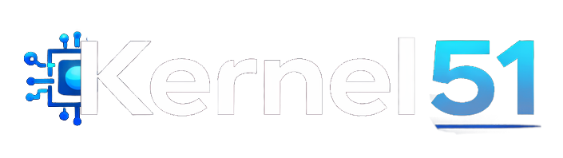

<h2>

 <strong>AI-Powered Platform Engineering</strong> 
 Intelligent Automation • DevOps • Azure • GitHub

</h2>

### AI Platform Engineering

Syntechtix builds **AI-powered engineering platforms** that help modern development teams automate and optimize how software is built, delivered, and operated.

Our solutions combine **AI orchestration, cloud infrastructure, and developer automation** to create intelligent systems that continuously improve engineering workflows. By integrating artificial intelligence into the software delivery lifecycle, we enable organizations to build adaptive platforms that reduce operational complexity and increase development velocity.

---

### Kernel51 

**Kernel51** is the core orchestration engine behind the Syntechtix platform.

Kernel51 is a **microkernel-based automation runtime** designed to orchestrate development workflows across modern cloud platforms. Built around a modular architecture, Kernel51 enables capabilities to be added as independent components while maintaining a stable and extensible core.

Kernel51 integrates **AI-driven intelligence** directly into the orchestration layer. These capabilities help automate decisions, optimize workflows, and provide predictive insights across development environments.

The **krnl51 CLI** provides a command-line interface for interacting with the Kernel51 runtime, enabling engineers to execute workflows, manage modules, and integrate automation into modern DevOps environments.

  

---

### Platform Capabilities

Syntechtix solutions combine AI orchestration with modern development infrastructure:

- **AI Platform Engineering** — LLM orchestration, MLOps automation, and intelligent platform systems  
- **Azure AI Integration** — Cloud-native AI architecture and Azure OpenAI integration  
- **GitHub AI Automation** — AI-enhanced workflow automation and intelligent CI/CD pipelines  
- **DevOps Engineering** — End-to-end automation and platform reliability systems  

---

### Learn More

- Website → https://syntechtix.com  
- Kernel51 → https://syntechtix.com/products/kernel51  

